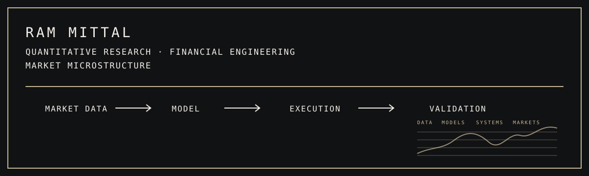
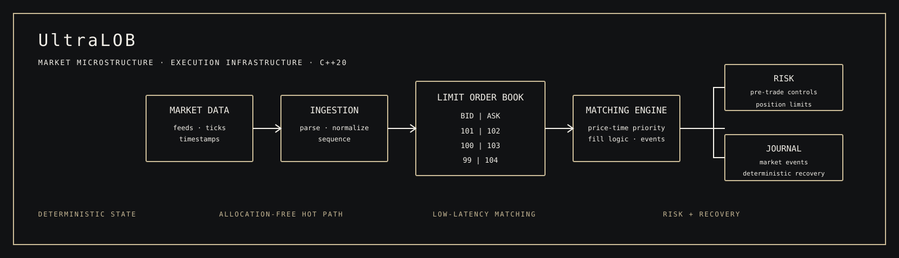
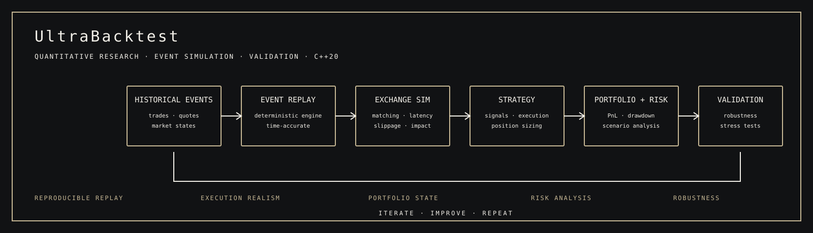

<div align="center">



<br>


</div>

---

<div align="center">

## THE RESEARCH DESK

*An evolving portfolio of quantitative systems, market infrastructure, and financial models.*

</div>

## 01 — PROFILE

I build quantitative research and financial systems at the intersection of **mathematics, statistics, computation, and market structure**.

My work is driven by a practical research loop: observe the market, formulate a hypothesis, express it quantitatively, simulate it under realistic assumptions, validate the result statistically, and understand how it behaves under risk and execution constraints.

The current portfolio spans **market microstructure, deterministic simulation, execution infrastructure, derivatives pricing, systematic research, and performance engineering**. The goal is not simply to make software that runs, but to build research infrastructure that makes results easier to measure, reproduce, interrogate, and improve.

---

## 02 — RESEARCH MANDATE

<table>
<tr>
<td width="25%" align="center">
<strong>QUANTITATIVE RESEARCH</strong><br><br>
<sub>Statistical modelling<br>Systematic strategies<br>Backtesting<br>Validation</sub>
</td>
<td width="25%" align="center">
<strong>FINANCIAL ENGINEERING</strong><br><br>
<sub>Derivatives pricing<br>Monte Carlo methods<br>Numerical methods<br>Risk</sub>
</td>
<td width="25%" align="center">
<strong>MARKET MICROSTRUCTURE</strong><br><br>
<sub>Limit order books<br>Order flow<br>Liquidity<br>Execution</sub>
</td>
<td width="25%" align="center">
<strong>TRADING SYSTEMS</strong><br><br>
<sub>Low latency<br>Deterministic replay<br>Market data<br>Performance</sub>
</td>
</tr>
</table>

---

## 03 — SELECTED SYSTEMS

### ◈ 01 / ULTRALOB

## Ultra-Low-Latency Limit Order Book & Matching Engine

**Execution Infrastructure · Market Microstructure · C++20**

UltraLOB is a high-performance C++20 execution system designed around **price-time priority matching, deterministic state transitions, allocation-free hot paths, lock-free ingestion, journaling and recovery, pre-trade risk, market-data distribution, and low-latency gateway design**.

The project focuses on the engineering problems that appear when a theoretical market model has to become an executable system: memory ownership, contention, queueing, state recovery, message handling, risk checks, and measurable latency.

<div align="center">

</div>

**Research lens**  
Order matching · liquidity representation · execution mechanics · latency · system determinism

→ **[Explore UltraLOB](https://github.com/ram-mittal/UltraLOB)**

---

### ◈ 02 / ULTRABACKTEST

## Deterministic Event-Driven Backtesting Infrastructure

**Quantitative Research · Simulation · Performance Engineering · C++20**

UltraBacktest is research infrastructure for **historical event replay, exchange simulation, strategy evaluation, portfolio accounting, risk controls, and reproducible execution research**.

The system is designed to separate the research question from the mechanics of replay: market events are processed deterministically, execution assumptions can be represented explicitly, and performance can be benchmarked against defined workloads rather than opaque wall-clock claims.

<div align="center">

</div>

**Research lens**  
Event replay · execution modelling · portfolio state · risk · reproducibility · simulation performance

→ **[Explore UltraBacktest](https://github.com/ram-mittal/Stratergy-tester)**

---

### ◈ 03 / NEXT RESEARCH TRACK

## GPU Monte Carlo Pricing Engine

**Financial Engineering · Derivatives · GPU Computing**

A planned computational-finance system exploring the full path from **stochastic modelling to accelerated derivatives pricing**.

The research track is intended to cover stochastic processes, Monte Carlo simulation, variance reduction, GPU parallelization, option pricing, Greeks, convergence analysis, validation against analytical solutions, and performance benchmarking.

**Research lens**  
Stochastic processes · numerical methods · Monte Carlo · derivatives · parallel computation

---

## 04 — RESEARCH PIPELINE

<div align="center">

```text
                         MARKET DATA
                              │
                              ▼
                     ┌────────────────┐
                     │   OBSERVATION  │
                     └───────┬────────┘
                             ▼
                     ┌────────────────┐
                     │    HYPOTHESIS  │
                     └───────┬────────┘
                             ▼
                     ┌────────────────┐
                     │ QUANTITATIVE   │
                     │     MODEL      │
                     └───────┬────────┘
                             ▼
                     ┌────────────────┐
                     │    BACKTEST    │
                     └───────┬────────┘
                             ▼
                     ┌────────────────┐
                     │   VALIDATION   │
                     └───────┬────────┘
                             ▼
                     ┌────────────────┐
                     │  RISK ANALYSIS │
                     └───────┬────────┘
                             ▼
                     ┌────────────────┐
                     │    EXECUTION   │
                     └───────┬────────┘
                             ▼
                         MONITORING
```

</div>

The purpose of the pipeline is to make the **entire research chain inspectable**. A result is only useful when its assumptions, data, simulation methodology, statistical properties, computational cost, and failure modes can be understood.

---

## 05 — RESEARCH PRINCIPLES

### I · DETERMINISM

Prefer reproducible state transitions, controlled experiments, and replayable simulations wherever practical.

### II · MEASUREMENT

Performance should be reported against an explicit workload, environment, methodology, and relevant baseline.

### III · MECHANISM

Execution, liquidity, latency, queue position, and risk are part of the model—not inconvenient details added afterwards.

### IV · VALIDATION

A strong backtest is a starting point. Robust research requires statistical checks, stress testing, sensitivity analysis, and awareness of model limitations.

### V · ENGINEERING DISCIPLINE

Keep critical paths explicit, memory behaviour observable, interfaces clear, and optimisation justified by measurement.

---

## 06 — TECHNOLOGY & METHODS

<table>
<tr>
<td width="33%"><strong>LANGUAGES</strong><br><br>C++20<br>Python<br>SQL</td>
<td width="33%"><strong>QUANTITATIVE</strong><br><br>NumPy<br>pandas<br>SciPy<br>Numerical Methods</td>
<td width="33%"><strong>SYSTEMS</strong><br><br>Linux<br>CMake<br>Multithreading<br>Lock-Free Design</td>
</tr>
<tr>
<td><strong>RESEARCH INFRASTRUCTURE</strong><br><br>Event-Driven Simulation<br>Deterministic Replay<br>Benchmarking<br>Profiling</td>
<td><strong>FINANCIAL COMPUTING</strong><br><br>Market Microstructure<br>Derivatives<br>Execution<br>Risk Systems</td>
<td><strong>PERFORMANCE</strong><br><br>Memory-Aware Design<br>Cache Locality<br>Latency Analysis<br>Parallel Computing</td>
</tr>
</table>

---

## 07 — PORTFOLIO ARCHITECTURE

<div align="center">

```text
                                  RAM MITTAL
                                      │
             ┌────────────────────────┼────────────────────────┐
             │                        │                        │
        QUANTITATIVE             FINANCIAL                  MARKET
          RESEARCH              ENGINEERING              MICROSTRUCTURE
             │                        │                        │
             │                        │                        │
       UltraBacktest             Monte Carlo                UltraLOB
             │                        │                        │
             └────────────────────────┼────────────────────────┘
                                      │
                                  EXECUTION
                                      │
                                  MONITORING
```

</div>

The projects are intentionally connected. **UltraBacktest** provides the research and simulation layer; **UltraLOB** represents the execution and microstructure layer; the Monte Carlo track extends the portfolio into computational financial engineering.

Together they form a progression from **model → simulation → market mechanics → execution**.

---

## 08 — RESEARCH QUESTIONS

> **How does execution mechanics alter realised strategy behaviour?**

> **How can historical market events be replayed deterministically at scale?**

> **How should liquidity and market microstructure be represented in a quantitative model?**

> **Where do numerical methods become computational bottlenecks in derivatives pricing?**

> **How can system performance improve without compromising reproducibility or model integrity?**

> **Which assumptions survive when a theoretical strategy meets realistic execution constraints?**

---

## 09 — THE STACK

<div align="center">

### MATHEMATICS
**Probability · Stochastic Processes · Numerical Methods**

↓

### STATISTICS
**Inference · Validation · Time-Series Analysis**

↓

### MARKET STRUCTURE
**Liquidity · Order Flow · Price Formation · Execution**

↓

### COMPUTATION
**C++ · Python · Parallelism · Performance Engineering**

↓

### SYSTEM DESIGN
**Simulation · Risk · Market Data · Deterministic Infrastructure**

↓

### QUANTITATIVE RESEARCH
**Research → Model → Validate → Execute**

</div>

---

## 10 — DIRECTION

The longer-term objective is to build a research stack capable of moving fluidly between **market data, mathematical models, statistical evidence, computational systems, and execution mechanics**.

Areas of continued exploration include:

- Market microstructure and order-flow modelling
- Execution and transaction-cost modelling
- Tick-level and event-driven simulation
- Derivatives pricing and numerical finance
- Monte Carlo and variance-reduction techniques
- Statistical validation and robustness analysis
- High-performance and parallel financial computation
- Research infrastructure for systematic strategies

---

## 11 — CONNECT

<div align="center">

**RAM MITTAL**

Quantitative Research · Financial Engineering · Market Microstructure

<br>

[**GitHub · @ram-mittal**](https://github.com/ram-mittal) &nbsp;&nbsp; ◇ &nbsp;&nbsp; [**LinkedIn · Ram Mittal**](https://linkedin.com/in/rammittal)

<br><br>

---

<sub>MATHEMATICS → MARKETS → SYSTEMS</sub>

</div>
